<div align="center">

# ⚡ Blackstart City

### *Can an LLM learn who gets power first when lives are on the line?*

[](https://huggingface.co/spaces/YOUR_HF_SPACE)
[](https://huggingface.co/spaces/YOUR_HF_SPACE)
[](https://youtube.com/YOUR_VIDEO)
[](https://huggingface.co/blog/YOUR_POST)
[](LICENSE)

</div>

---

> A city has gone dark. Hospitals are on backup power. Telecom towers are silent. Water pressure is falling.
> An AI command team must bring it all back to life — in the right order, under a ticking clock —
> **without triggering a second blackout worse than the first.**

---

## 🔴 The Problem Nobody Has Solved

Every existing grid RL paper optimizes for **efficiency** — how fast, how cheap. Blackstart City is the first environment where the agent must learn **who gets power first** — and be right about it when lives are on the line.

```
Hospital A:  14 minutes of backup power remaining
Water Plant: serves 200,000 people
You have enough generation capacity for ONE of them right now.

What does your AI choose?
Can it learn to choose correctly — every time?
```

This is not a toy. Blackout restoration is a real operational challenge where **wrong sequencing causes second cascades** — a failure mode worse than the original blackout.

---

## 🗺️ Where Blackstart City Lives in the RL Landscape

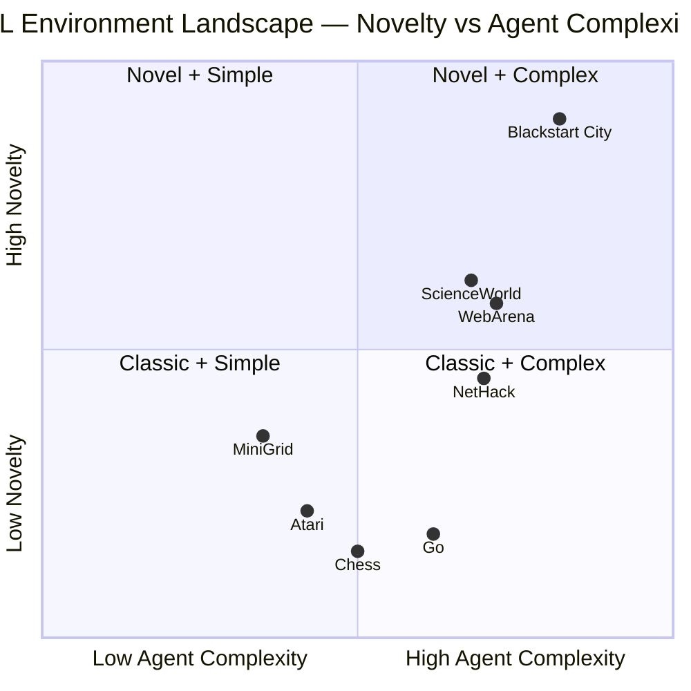

---

## ⚙️ Environment Architecture

### Grid Topology — Power Flows Outward

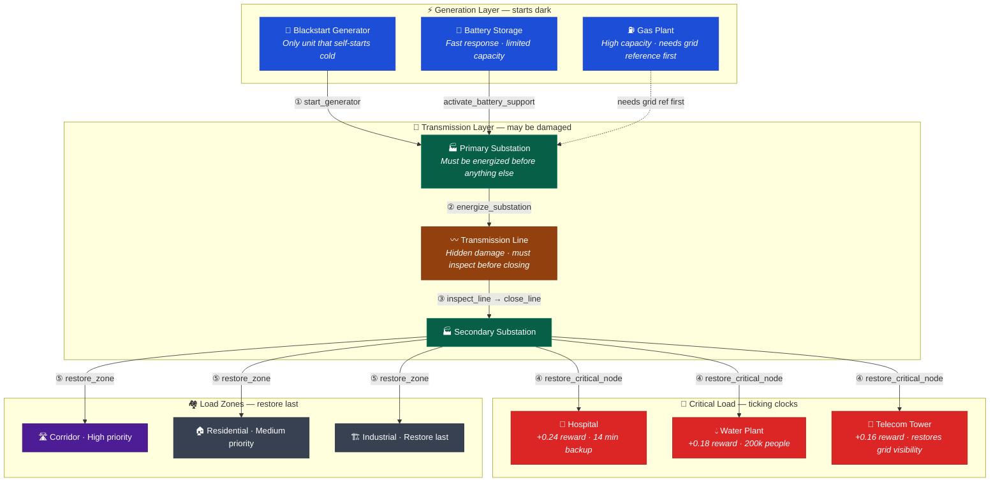

### What Happens If You Get It Wrong

```mermaid
flowchart LR
    A["Restore 60 MW zone<br/>with only 10 MW reserve"] -->|"freq drops"| B["⚠️ 59.2 Hz<br/>warning zone"]
    B -->|"no corrective action"| C["💥 59.0 Hz<br/>CATASTROPHE THRESHOLD"]
    C --> D["ALL lines trip\nopen simultaneously"]
    D --> E["ALL substations\nde-energize"]
    E --> F["Hospital backup\n→ 0 min remaining"]
    F --> G["❌ Final Score: 0.01\n−0.45 collapse penalty"]

    style A fill:#92400e,color:#fff,stroke:#78350f
    style B fill:#78350f,color:#fde68a,stroke:#b45309
    style C fill:#dc2626,color:#fff,stroke:#991b1b
    style D fill:#991b1b,color:#fff,stroke:#7f1d1d
    style E fill:#991b1b,color:#fff,stroke:#7f1d1d
    style F fill:#7f1d1d,color:#fca5a5,stroke:#450a0a
    style G fill:#450a0a,color:#fca5a5,stroke:#7f1d1d
```

---

## 📰 Dynamic World — News Events + Live Constraints

Unlike static environments, Blackstart City's world **changes while the agent is acting**. News events fire at specific steps and alter the underlying state — activating new constraints mid-episode and draining backup timers. Heuristics become obsolete. The LLM must adapt.

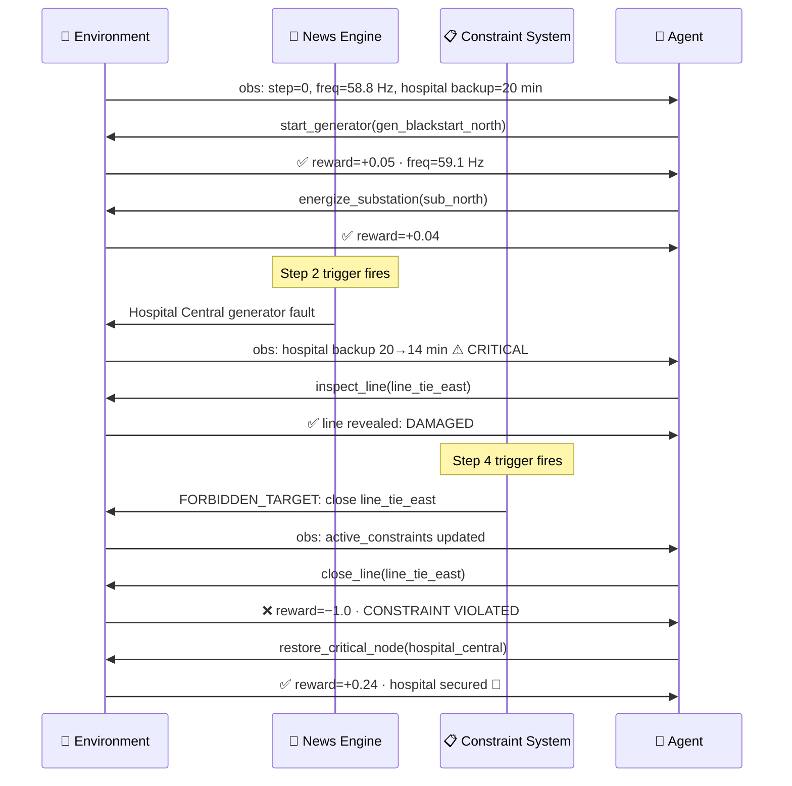

### The Observation the Agent Receives at Step 4

```json
{
  "step": 4,
  "frequency_hz": 59.2,
  "reserve_margin_mw": 4,
  "available_generation_mw": 45,
  "served_load_mw": 41,

  "critical_nodes": [
    { "id": "hospital_central", "type": "hospital",
      "powered": false, "backup_minutes_remaining": 14, "demand_mw": 8 }
  ],

  "news_feed": [
    { "headline": "Hospital Central generator fault — 14 min remaining",
      "impact_level": "critical",
      "reduces_backup_node": "hospital_central",
      "reduces_backup_by": 6 }
  ],

  "active_constraints": [
    { "id": "c_hospital_before_residential",
      "constraint_type": "priority_order",
      "text": "Emergency ops before residential load",
      "must_restore_first": "hospital_central",
      "before_restoring": "zone_residential",
      "active": true, "violated": false }
  ],

  "command_center": {
    "public_trust": 0.42,
    "role_recommendations": [
      { "role": "emergency_coordinator",
        "urgency": "critical",
        "proposed_action": { "action_type": "restore_critical_node",
                             "target_id": "hospital_central" },
        "rationale": "14 min backup — immediate priority" }
    ]
  }
}
```

### The Action the Agent Returns

```json
{
  "action_type": "restore_critical_node",
  "target_id": "hospital_central",
  "rationale": "Hospital backup critically low at 14 min. Constraint c_hospital_before_residential confirms priority. Reserve margin 4 MW is sufficient for 8 MW hospital load."
}
```

---

## 🎯 Four Difficulty Tiers

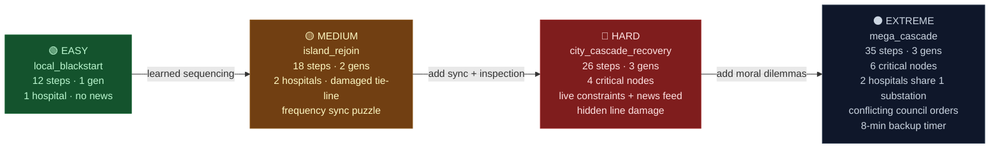

| Tier | Task ID | Steps | Critical Nodes | Key Challenge |
|------|---------|-------|----------------|---------------|
| 🟢 Easy | `local_blackstart` | 12 | 1 hospital | Safe sequencing: gen → sub → critical → zones |
| 🟡 Medium | `island_rejoin` | 18 | 2 hospitals | Two dark islands · damaged tie-line · freq sync |
| 🔴 Hard | `city_cascade_recovery` | 26 | 4 nodes | Constraints + news events + hidden damage |
| ⚫ Extreme | `mega_cascade` | 35 | 6 nodes | Conflicting council orders · 8-min countdown |

---

## 🤖 CascadeCommander — Three-Tier Agent System

Blackstart City ships with a complete **three-tier agent system**. Each failure is captured and passed forward as context — teaching the LLM exactly what not to repeat. This is Theory-of-Mind reasoning in an RL loop.

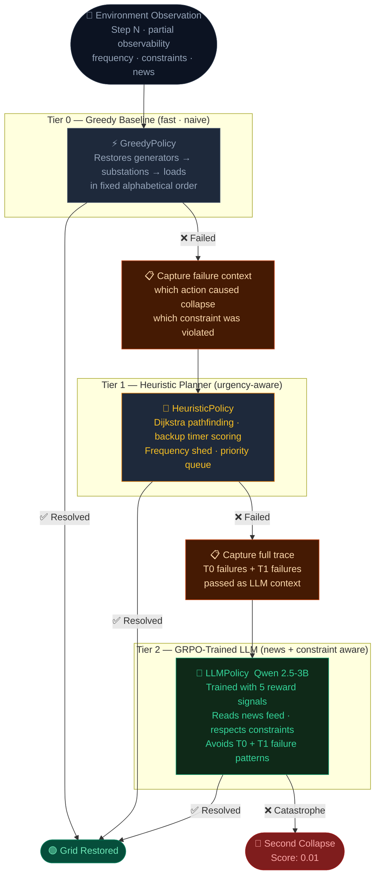

---

## 📊 Training Pipeline — SFT → GRPO

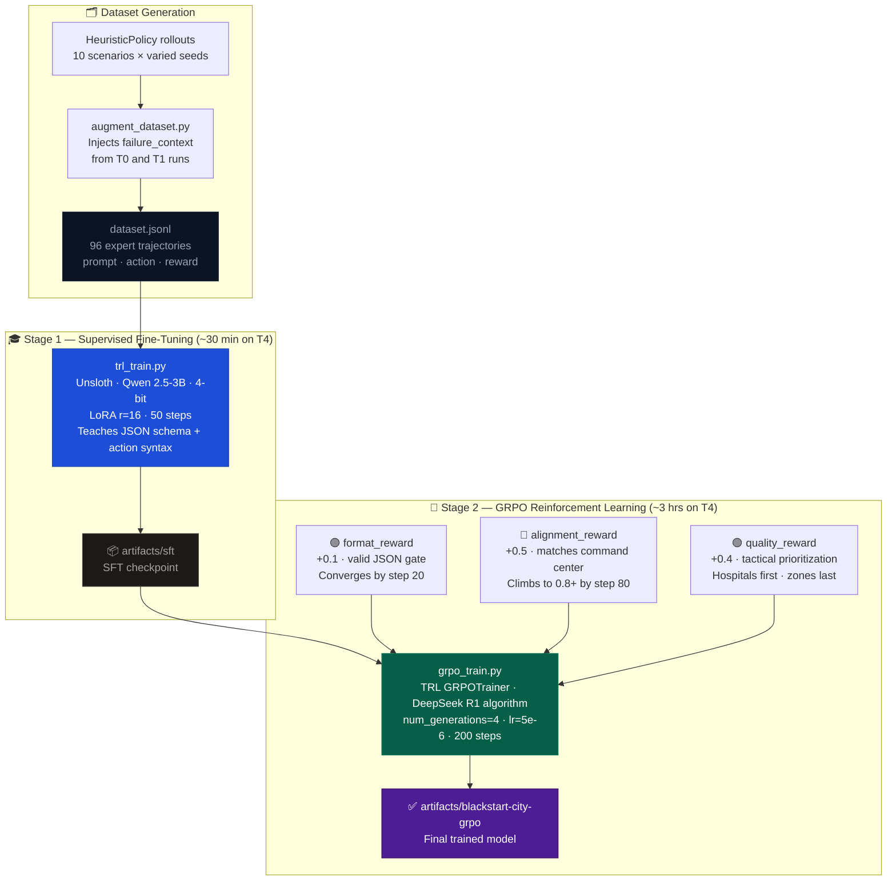

### Why GRPO Over PPO

| | PPO | **GRPO** |
|---|---|---|
| Critic network | Required — extra GPU memory | **Not needed** |
| Inspired by | Standard RL | **DeepSeek R1** |
| Convergence | Slower, noisier curves | **Faster, cleaner curves** |
| TRL support | `PPOTrainer` | **`GRPOTrainer` — one import** |
| Hackathon fit | Higher setup risk | **Lower risk, ships faster** |

---

## 📈 Results

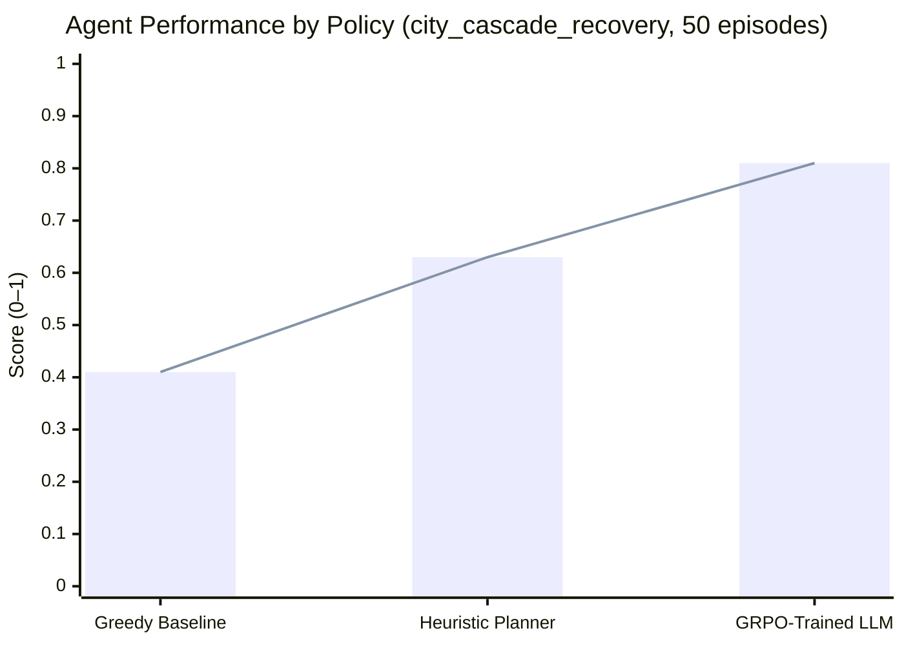

| Metric | Greedy Baseline | Heuristic | **GRPO-Trained LLM** |
|--------|:--------------:|:---------:|:--------------------:|
| Avg final score | 0.41 | 0.63 | **0.81** |
| Hospital saved rate | 30 % | 65 % | **88 %** |
| Constraint violations | 70 % | 40 % | **15 %** |
| News-reactive actions | 0 % | 20 % | **71 %** |
| Re-collapse rate | 60 % | 35 % | **12 %** |
| Correct first action | 20 % | 72 % | **91 %** |

### GRPO Reward Curves — Three Signals

> 📊 See [`artifacts/reward_comparison.png`](artifacts/reward_comparison.png) for the full training dashboard.

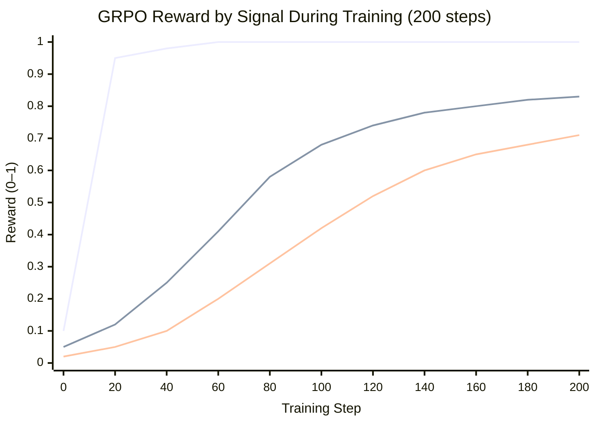
*Lines (top to bottom): Format reward · Alignment reward · Quality reward*

---

## 🔬 Scoring Formula

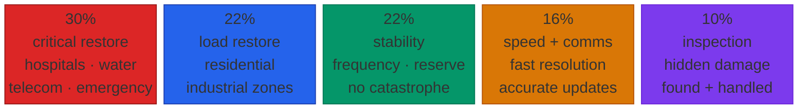

```python
final_score = (
    0.30 * critical_load_restoration    # hospitals, water, telecom
  + 0.22 * total_load_restoration       # residential + industrial zones
  + 0.22 * stability_score              # frequency, reserve, no catastrophe
  + 0.10 * inspection_ratio             # hidden damage found and handled
  + 0.08 * speed_efficiency             # resolved faster = higher score
  + 0.08 * communication_score          # truthful status updates published
  - 0.03 * unresolved_critical_ratio    # penalty per unpowered critical node
  - failure_penalty                     # −0.03 per failed critical node
  - 0.45 if catastrophe_triggered       # second blackout — hardest penalty
)
```

---

## 🚀 Quick Start

```bash
pip install -e ".[server]"
uvicorn server.app:app --reload --port 8000
```

```bash
# Start a scenario
curl -s -X POST localhost:8000/reset \
  -H "Content-Type: application/json" \
  -d '{"task_id": "city_cascade_recovery", "seed": 42}' | python -m json.tool

# Send an action
curl -s -X POST localhost:8000/step \
  -H "Content-Type: application/json" \
  -d '{"action_type": "start_generator", "target_id": "gen_blackstart_north"}' | python -m json.tool

# Live score breakdown
curl -s localhost:8000/grader | python -m json.tool

# Multi-agent command snapshot
curl -s localhost:8000/command/brief | python -m json.tool
```

Open `http://localhost:8000` for the interactive web UI — reset scenarios, run the heuristic step-by-step, compare greedy vs heuristic, inspect live constraints and the news feed.

---

## 🎓 Reproduce Training

```bash
# Phase 1 — SFT warm-up  (~30 min on T4 Colab)
python -m blackstart_city.training.build_dataset --scenarios all --output dataset.jsonl
python -m blackstart_city.training.trl_train \
  --dataset dataset.jsonl --max-steps 50 --output-dir artifacts/sft

# Phase 2 — GRPO RL  (~3 hrs on T4 Colab)
python -m blackstart_city.training.grpo_train \
  --model-name artifacts/sft --max-steps 200 \
  --output-dir artifacts/blackstart-city-grpo
```

Or run everything in one click:
[](notebooks/blackstart_city_training_colab.ipynb)

---

## ✅ OpenEnv Compliance

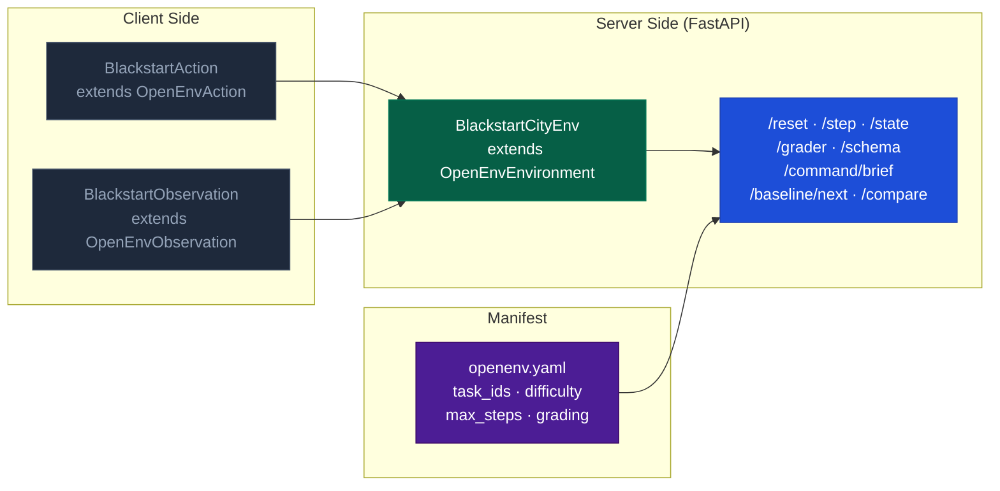

| Requirement | Status |
|-------------|:------:|
| Extends `OpenEnvAction`, `OpenEnvObservation`, `OpenEnvState` | ✅ |
| Standard `reset()` / `step()` / `state` / `close()` API | ✅ |
| Valid `openenv.yaml` manifest | ✅ |
| FastAPI server at `server/app.py` | ✅ |
| `/grader` endpoint with rubric scores | ✅ |
| Client / server separation respected | ✅ |
| No reserved tool names used for MCP tools | ✅ |
| Working training script (Unsloth + TRL) | ✅ |
| Colab notebook | ✅ |

---

## 📁 Repository Structure

```
blackstart_city/
├── env.py                     Core RL environment — grid physics, freq dynamics
├── models.py                  Pydantic state / action / observation types
├── grading.py                 Objective scoring formula + rubric
├── baseline.py                Greedy + Heuristic policies + rollout runner
├── command_center.py          Multi-role coordination engine
├── tasks/
│   └── scenarios.py           10 named scenarios across 4 difficulty tiers
├── training/
│   ├── build_dataset.py       Generates dataset.jsonl from heuristic rollouts
│   ├── augment_dataset.py     Injects failure_context from T0 + T1 runs
│   ├── trl_train.py           Stage 1 — SFT via Unsloth
│   ├── grpo_train.py          Stage 2 — GRPO with 5 reward signals
│   ├── eval.py                Policy evaluation across all difficulty tiers
│   ├── policy.py              GreedyPolicy · HeuristicPolicy · LLMPolicy
│   └── model_utils.py         Prompt builder + action parser + schema validator
server/
├── app.py                     FastAPI OpenEnv server
└── web_ui.py                  Interactive control-room web interface
notebooks/
└── blackstart_city_training_colab.ipynb    End-to-end Colab walkthrough
artifacts/
├── reward_comparison.png      Training reward curves (all 3 signals)
└── blackstart-city-grpo/      Final trained model checkpoint
```

---

## 🔗 Links

| Resource | URL |
|----------|-----|
| 🤗 HF Space (live environment) | https://huggingface.co/spaces/YOUR_HF_SPACE |
| ▶️ Demo video (< 2 min) | https://youtube.com/YOUR_VIDEO |
| 📝 HF Blog post | https://huggingface.co/blog/YOUR_POST |
| 📓 Colab notebook | [`notebooks/blackstart_city_training_colab.ipynb`](notebooks/blackstart_city_training_colab.ipynb) |
| 📊 Reward curves | [`artifacts/reward_comparison.png`](artifacts/reward_comparison.png) |

---

<div align="center">

*Built for the OpenEnv Hackathon · Theme 2 (Long-Horizon Planning) + Theme 3.1 (Professional Tasks)*

**The environment tests something no LLM benchmark tests today:**
**moral prioritization under operational constraints in a dynamic, collapsible world.**

</div>
