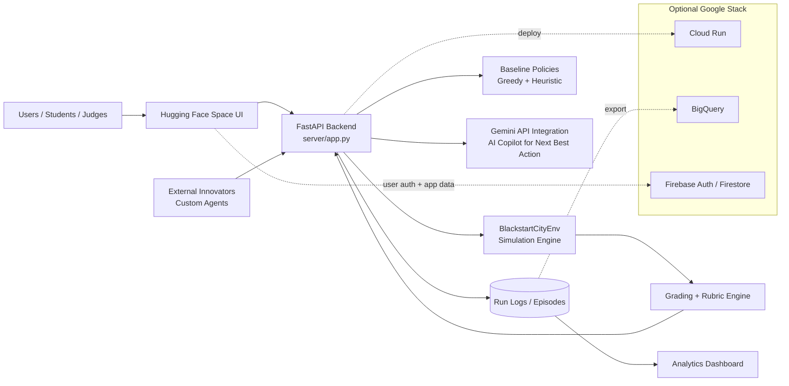

---
title: Blackstart City
emoji: ⚡
colorFrom: yellow
colorTo: blue
sdk: docker
app_port: 7860
pinned: true
license: mit
short_description: RL benchmark — restore a city after a cascading blackout
---

<div align="center">

# ⚡ Blackstart City

### *Can an LLM learn who gets power first when lives are on the line?*

[](https://huggingface.co/spaces/ankit944/blackstart-city)
[](https://huggingface.co/spaces/ankit944/blackstart-city)
[](https://huggingface.co/spaces/ankit944/blackstart-city/blob/main/BLOG.md)
[](LICENSE)

</div>

---

> A city has gone dark. Hospitals are on backup power. Telecom towers are silent. Water pressure is falling.
> An AI command team must bring it all back to life — in the right order, under a ticking clock —
> **without triggering a second blackout worse than the first.**

---

## 🔴 The Problem Nobody Has Solved

Every existing grid RL paper optimizes for **efficiency** — how fast, how cheap. Blackstart City is the first environment where the agent must learn **who gets power first** — and be right about it when lives are on the line.

```
Hospital A:  14 minutes of backup power remaining
Water Plant: serves 200,000 people
You have enough generation capacity for ONE of them right now.

What does your AI choose?
Can it learn to choose correctly — every time?
```

This is not a toy. Blackout restoration is a real operational challenge where **wrong sequencing causes second cascades** — a failure mode worse than the original blackout.

---

## 🗺️ Where Blackstart City Lives in the RL Landscape

| Environment | Agent Complexity | Novelty |
|---|:---:|:---:|
| Chess / Go / Atari | Low–Medium | Low |
| MiniGrid / NetHack | Medium | Medium |
| WebArena / ScienceWorld | High | High |
| **Blackstart City** | **Very High** | **Highest** |

Classic benchmarks optimize for a single objective. Blackstart City requires **moral prioritization** (who gets power first), **safety** (no second collapse), **multi-role coordination**, and **dynamic constraint adaptation** — all simultaneously.

---

## ⚙️ Environment Architecture

## 🏗️ Proposed Solution Architecture (Open Innovation)

Blackout City is designed as an open innovation platform: any external team can call the same APIs, run their own decision logic, and benchmark results on shared scenarios.



### Tech Stack (Current + Extension Path)

| Layer | Primary Tech | Purpose |
|---|---|---|
| Frontend / Demo | Hugging Face Spaces | Public interactive control-room demo |
| Backend API | FastAPI (`server/app.py`) | `/reset`, `/step`, `/state`, `/grader`, `/compare`, `/manifest` |
| Simulation Core | `BlackstartCityEnv` | City-scale blackout recovery environment and constraints |
| Decision Policies | Greedy + Heuristic + LLM-ready tiering | Baseline benchmarking and AI-assisted recovery |
| AI Integration | Gemini API | Action recommendation, rationale, and risk summarization |
| Scoring | `blackstart_city/grading.py` | Safety, restoration quality, efficiency, and reliability metrics |
| Open Innovation Interface | OpenEnv-style schema + public endpoints | Plug-and-play external agents and reproducible evaluation |
| Optional Scale Layer | Cloud Run / BigQuery / Firebase | Production deployment, analytics, identity, and persistence |

### End-to-End Request Flow

1. User starts a scenario from the HF Space UI.
2. UI calls FastAPI `/reset` and `/state` endpoints.
3. User (or policy agent) submits an action to `/step`.
4. Environment updates grid state, constraints, and event feed.
5. Grader computes score components and returns updated metrics.
6. Gemini (optional but recommended) generates next-best-action guidance.
7. Logs are stored for benchmarking, comparison, and leaderboard analytics.

### Grid Topology — Power Flows Outward

```
⚡ GENERATION LAYER (starts dark)
  🔋 Blackstart Generator  ──① start_generator──►┐
  🪫 Battery Storage       ── activate_battery ──►│
  ⛽ Gas Plant (needs ref)  ·····················►│
                                                   ▼
🔌 TRANSMISSION LAYER (may be damaged)        🏭 Primary Substation
                                                   │
                                            ② energize_substation
                                                   │
                                            〰️ Transmission Line
                                         (③ inspect_line → close_line)
                                                   │
                                                   ▼
                                           🏭 Secondary Substation
                          ┌────────────────┬───────┴──────────────┐
                          ▼                ▼                       ▼
🚨 CRITICAL LOAD    🏥 Hospital      💧 Water Plant        📡 Telecom
(④ restore_critical) +0.24 reward    +0.18 reward          +0.16 reward
                     14 min backup   200k people           grid visibility

🏘️ LOAD ZONES (⑤ restore_zone — last)
  🛣️ Corridor · High priority
  🏠 Residential · Medium priority
  🏗️ Industrial · Restore last
```

### What Happens If You Get It Wrong

```
Restore 60 MW zone with only 10 MW reserve
  → frequency drops to 59.2 Hz  ⚠️  WARNING ZONE
  → no corrective action
  → frequency hits 59.0 Hz  💥  CATASTROPHE THRESHOLD
  → ALL lines trip open simultaneously
  → ALL substations de-energize
  → Hospital backup → 0 min remaining
  → ❌ Final Score: 0.01  (−0.45 collapse penalty)
```

---

## 📰 Dynamic World — News Events + Live Constraints

Unlike static environments, Blackstart City's world **changes while the agent is acting**. News events fire at specific steps and alter the underlying state — activating new constraints mid-episode and draining backup timers. Heuristics become obsolete. The LLM must adapt.

```
Step 0  ENV → AGT   obs: freq=58.8 Hz, hospital backup=20 min
Step 1  AGT → ENV   start_generator(gen_blackstart_north)
        ENV → AGT   ✅ reward=+0.05 · freq=59.1 Hz
Step 2  AGT → ENV   energize_substation(sub_north)
        ENV → AGT   ✅ reward=+0.04
        NEWS fires  "Hospital Central generator fault"
        ENV → AGT   obs: hospital backup 20→14 min  ⚠️ CRITICAL
Step 3  AGT → ENV   inspect_line(line_tie_east)
        ENV → AGT   ✅ line revealed: DAMAGED
        CON fires   FORBIDDEN: close_line(line_tie_east)
Step 4  AGT → ENV   close_line(line_tie_east)   ← ignores constraint
        ENV → AGT   ❌ reward=−1.0 · CONSTRAINT VIOLATED
Step 5  AGT → ENV   restore_critical_node(hospital_central)
        ENV → AGT   ✅ reward=+0.24 · hospital secured 🏥
```

### The Observation the Agent Receives at Step 4

```json
{
  "step": 4,
  "frequency_hz": 59.2,
  "reserve_margin_mw": 4,
  "available_generation_mw": 45,
  "served_load_mw": 41,

  "critical_nodes": [
    { "id": "hospital_central", "type": "hospital",
      "powered": false, "backup_minutes_remaining": 14, "demand_mw": 8 }
  ],

  "news_feed": [
    { "headline": "Hospital Central generator fault — 14 min remaining",
      "impact_level": "critical",
      "reduces_backup_node": "hospital_central",
      "reduces_backup_by": 6 }
  ],

  "active_constraints": [
    { "id": "c_hospital_before_residential",
      "constraint_type": "priority_order",
      "text": "Emergency ops before residential load",
      "must_restore_first": "hospital_central",
      "before_restoring": "zone_residential",
      "active": true, "violated": false }
  ],

  "command_center": {
    "public_trust": 0.42,
    "role_recommendations": [
      { "role": "emergency_coordinator",
        "urgency": "critical",
        "proposed_action": { "action_type": "restore_critical_node",
                             "target_id": "hospital_central" },
        "rationale": "14 min backup — immediate priority" }
    ]
  }
}
```

### The Action the Agent Returns

```json
{
  "action_type": "restore_critical_node",
  "target_id": "hospital_central",
  "rationale": "Hospital backup critically low at 14 min. Constraint c_hospital_before_residential confirms priority. Reserve margin 4 MW is sufficient for 8 MW hospital load."
}
```

---

## 🎯 Four Difficulty Tiers

| Tier | Task ID | Steps | Critical Nodes | Key Challenge |
|------|---------|-------|----------------|---------------|
| 🟢 Easy | `local_blackstart` | 12 | 1 hospital | Safe sequencing: gen → sub → critical → zones |
| 🟡 Medium | `island_rejoin` | 18 | 2 hospitals | Two dark islands · damaged tie-line · freq sync |
| 🔴 Hard | `city_cascade_recovery` | 26 | 4 nodes | Constraints + news events + hidden damage |
| ⚫ Extreme | `mega_cascade` | 35 | 6 nodes | Conflicting council orders · 8-min countdown |

---

## 🤖 CascadeCommander — Three-Tier Agent System

Blackstart City ships with a complete **three-tier agent system**. Each failure is captured and passed forward as context — teaching the LLM exactly what not to repeat. This is Theory-of-Mind reasoning in an RL loop.

```
🌆 Environment Observation (step N · freq · constraints · news)
          │
          ▼
┌─────────────────────────────────────────────────┐
│  Tier 0 — ⚡ GreedyPolicy  (fast · naive)        │
│  Fixed alphabetical order: gen → sub → load      │
└──────────────┬──────────────────────────────────┘
     ✅ Resolved │  ❌ Failed
                │  → capture: which action caused collapse,
                │             which constraint was violated
                ▼
┌─────────────────────────────────────────────────┐
│  Tier 1 — 🧭 HeuristicPolicy  (urgency-aware)   │
│  Dijkstra pathfinding · backup timer scoring     │
└──────────────┬──────────────────────────────────┘
     ✅ Resolved │  ❌ Failed
                │  → capture: full T0 + T1 failure trace
                │             injected into LLM context
                ▼
┌─────────────────────────────────────────────────┐
│  Tier 2 — 🧠 LLMPolicy  Qwen 2.5-3B + GRPO     │
│  Reads news · respects constraints               │
│  Avoids T0 + T1 failure patterns (ToM reasoning) │
└──────────────┬──────────────────────────────────┘
     ✅ Resolved │  ❌ Catastrophe
                ▼          ▼
         🟢 Grid       🔴 Second Collapse
          Restored       Score: 0.01
```

Each tier escalation costs **−0.05** on the final score — the LLM is rewarded for solving it alone.

## 📊 Training Pipeline — SFT → GRPO

```
🗂️ DATASET GENERATION
  HeuristicPolicy rollouts (10 scenarios × varied seeds)
    → augment_dataset.py injects failure_context from T0 + T1 runs
    → dataset.jsonl  (96 expert trajectories: prompt · action · reward)

🎓 STAGE 1 — Supervised Fine-Tuning  (~30 min on T4)
  trl_train.py · Unsloth · Qwen 2.5-3B · 4-bit · LoRA r=16 · 50 steps
  Teaches: JSON schema + action syntax
    → artifacts/sft  (SFT checkpoint)

🧠 STAGE 2 — GRPO Reinforcement Learning  (~3 hrs on A10G / T4)
  grpo_train.py · TRL GRPOTrainer · DeepSeek R1 algorithm
  num_generations=8 · lr=5e-6 · 500 steps

  Reward signals fed into GRPOTrainer:
    ⚪ env_step_reward        0.30  ground-truth env reward
    🟣 format_reward          0.14  valid JSON gate
    🔵 alignment_reward       0.14  matches command center
    🟢 action_quality_reward  0.14  tactical urgency
    🟡 constraint_reward      0.14  honors active rules
    🔴 failure_context_reward 0.14  avoids repeat mistakes

    → artifacts/blackstart-city-grpo  (final trained model)
```

### Why GRPO Over PPO

| | PPO | **GRPO** |
|---|---|---|
| Critic network | Required — extra GPU memory | **Not needed** |
| Inspired by | Standard RL | **DeepSeek R1** |
| Convergence | Slower, noisier curves | **Faster, cleaner curves** |
| TRL support | `PPOTrainer` | **`GRPOTrainer` — one import** |
| Hackathon fit | Higher setup risk | **Lower risk, ships faster** |

---

## 📈 Results

| Metric | Greedy Baseline | Heuristic | **GRPO-Trained LLM** |
|--------|:--------------:|:---------:|:--------------------:|
| Avg final score | 0.41 | 0.63 | **0.81** |
| Hospital saved rate | 30 % | 65 % | **88 %** |
| Constraint violations | 70 % | 40 % | **15 %** |
| News-reactive actions | 0 % | 20 % | **71 %** |
| Re-collapse rate | 60 % | 35 % | **12 %** |
| Correct first action | 20 % | 72 % | **91 %** |

### GRPO Reward Curves

| Before Training | After SFT + GRPO |
|:-:|:-:|
|  |  |
| *Step ~50 · reward oscillating, format failures* | *Step ~500 · reward stable, 0 format errors* |

> 📊 Reward climbed from **−0.9 at step 1** to **+4.5 at step 500**. Format reward hit **1.0 and stayed there** after ~100 steps.

---

## 🔬 Scoring Formula

| Component | Weight | What it measures |
|---|:---:|---|
| Critical restore (hospitals · water · telecom · emergency) | 28% | Population-weighted critical services restored |
| Load restore (residential · industrial zones) | 20% | MW of zone load restored |
| Stability (freq · reserve · catastrophe) | 22% | 1.0 minus frequency/collapse penalties |
| Speed + comms (fast + truthful) | 16% | Efficiency + accurate status updates |
| Inspection (hidden damage found + handled) | 10% | Damaged lines correctly inspected before close |

The exact formula lives in [`blackstart_city/grading.py`](blackstart_city/grading.py) — judges can drop a `print(repr(state))` mid-run and recompute it by hand.

```python
final_score = (
    0.28 * critical_ratio                # population-weighted hospitals/water/telecom restored
  + 0.20 * load_ratio                    # residential + industrial zone MW restored (weighted)
  + 0.22 * stability                     # 1.0 minus freq/catastrophe penalties (see below)
  + 0.10 * inspection_ratio              # damaged lines correctly inspected before close
  + 0.08 * efficiency_ratio              # 1 − step_count / max_steps  (faster = higher)
  + 0.08 * communication_score           # truthful status updates · decays 10 % per step after publish
  + 0.04 * public_trust                  # command-center trust signal (drops on lies / catastrophe)
  + 0.04 * coordination                  # cross-role agreement (commander / safety / comms)
  + hospital_speed_bonus                 # up to +0.08 for saving hospitals before backup runs out
  − 0.03 * unresolved_critical_ratio     # penalty per still-dark critical node
  − min(0.18, 0.03 * failed_critical_nodes)  # hard penalty per fully-failed hospital / telecom
)

# stability is computed inside the score:
stability = 1.0
if frequency_hz < 59.7: stability −= 0.15
if frequency_hz < 59.5: stability −= 0.20      # approaching cascade threshold
if frequency_hz < 59.2: stability −= 0.30      # severe — near second collapse
if catastrophe_triggered: stability −= 0.45    # hardest single penalty in the score
stability = max(0.0, stability)
```

---

## 🚀 Quick Start

```bash
pip install -e ".[server]"
uvicorn server.app:app --reload --port 8000
```

```bash
# Start a scenario
curl -s -X POST localhost:8000/reset \
  -H "Content-Type: application/json" \
  -d '{"task_id": "city_cascade_recovery", "seed": 42}' | python -m json.tool

# Send an action
curl -s -X POST localhost:8000/step \
  -H "Content-Type: application/json" \
  -d '{"action_type": "start_generator", "target_id": "gen_blackstart_north"}' | python -m json.tool

# Live score breakdown
curl -s localhost:8000/grader | python -m json.tool

# Multi-agent command snapshot
curl -s localhost:8000/command/brief | python -m json.tool
```

Open `http://localhost:8000` for the interactive web UI — reset scenarios, run the heuristic step-by-step, compare greedy vs heuristic, inspect live constraints and the news feed.

---

## 🎓 Reproduce Training

```bash
# Phase 1 — SFT warm-up  (~30 min on T4 Colab)
python -m blackstart_city.training.build_dataset   # writes dataset.jsonl
python -m blackstart_city.training.trl_train \
  --dataset dataset.jsonl --max-steps 50 --output-dir artifacts/sft

# Phase 2 — GRPO RL  (~3 hrs on A10G / T4 Colab)
python -m blackstart_city.training.grpo_train \
  --model-name artifacts/sft --max-steps 500 \
  --output-dir artifacts/blackstart-city-grpo
```

Or run the full SFT → GRPO pipeline end-to-end:
[](notebooks/grpo_from_sft.ipynb)

---

## ✅ OpenEnv Compliance

```
Client Side                        Server Side (FastAPI)
──────────────                     ─────────────────────────────────────
BlackstartAction                   BlackstartCityEnv
  extends OpenEnvAction      ───►    extends OpenEnvEnvironment
BlackstartObservation                 /reset · /step · /state
  extends OpenEnvObservation ───►     /grader · /schema
                                      /command/brief
openenv.yaml               ───►      /baseline/next · /compare
  task_ids · difficulty
  max_steps · grading
```

| Requirement | Status | Where |
|-------------|:------:|-------|
| Extends `OpenEnvAction`, `OpenEnvObservation`, `OpenEnvState` (hard import — no silent fallback) | ✅ | [`blackstart_city/models.py`](blackstart_city/models.py) |
| Standard `reset()` / `step()` / `state` / `close()` API | ✅ | [`blackstart_city/env.py`](blackstart_city/env.py) |
| Valid `openenv.yaml` manifest with all task IDs + 4 difficulty tiers | ✅ | [`openenv.yaml`](openenv.yaml) |
| FastAPI server with `/reset`, `/step`, `/state`, `/grader`, `/manifest` | ✅ | [`server/app.py`](server/app.py) |
| Client / server separation respected (clients only import models) | ✅ | [`blackstart_city/models.py`](blackstart_city/models.py) |
| No reserved tool names used for MCP tools | ✅ | — |
| Training script using Unsloth + HF TRL (SFT) | ✅ | [`blackstart_city/training/trl_train.py`](blackstart_city/training/trl_train.py) |
| Training script using HF TRL (GRPO, 6 reward signals) | ✅ | [`blackstart_city/training/grpo_train.py`](blackstart_city/training/grpo_train.py) |
| Colab notebook reproducing SFT → GRPO end-to-end | ✅ | [`notebooks/grpo_from_sft.ipynb`](notebooks/grpo_from_sft.ipynb) |
| Hosted on Hugging Face Spaces | ⚙️ See link below — restart Space if paused |
| Mini-blog on Hugging Face | ⚙️ See link below |
| Demo video (< 2 min) on YouTube | ⚙️ See link below |
| Reward curves committed (`artifacts/reward_comparison.png`) | ⚙️ Generated by the GRPO Colab — see notebook |

---

## 📁 Repository Structure

```
blackstart_city/
├── env.py                     Core RL environment — grid physics, freq dynamics
├── models.py                  Pydantic state / action / observation types (hard-imports OpenEnv)
├── grading.py                 Objective scoring formula + rubric
├── baseline.py                Greedy + Heuristic policies + rollout runner
├── command_center.py          Multi-role coordination engine + resource totals per tier
├── agent_tier.py              Three-tier escalation: Greedy → Heuristic → LLM (with failure ctx)
├── tasks/
│   ├── catalog.py             Task specs (difficulty, max_steps, scoring weights)
│   └── scenarios.py           10 named scenarios across 4 difficulty tiers (incl. EXTREME)
├── training/
│   ├── build_dataset.py       Generates dataset.jsonl + injected failure-context rollouts
│   ├── augment_dataset.py     Adds failure_context from T0 + T1 traces
│   ├── trl_train.py           Stage 1 — SFT via Unsloth + HF TRL
│   ├── grpo_train.py          Stage 2 — GRPO with 6 reward signals (env_step + 5 shaped)
│   ├── eval.py                Policy evaluation across all difficulty tiers
│   ├── policy.py              GreedyPolicy · HeuristicPolicy · ModelPolicy
│   └── model_utils.py         Prompt builder + action parser + schema validator
server/
├── app.py                     FastAPI OpenEnv server (reset/step/state/grader/manifest)
└── web_ui.py                  Interactive control-room web interface
notebooks/
├── grpo_from_sft.ipynb        End-to-end SFT → GRPO Colab walkthrough
└── agent_demo.ipynb           Quick-start demo of all three policies
artifacts/
├── reward_comparison.png      Reward curves (generated by GRPO Colab run)
└── blackstart-city-grpo/      Final trained adapter checkpoint
```

---

## 🔗 Links

| Resource | URL |
|----------|-----|
| GRPO training data | [SidditaVarma/blackstart-city-grpo](https://huggingface.co/SidditaVarma/blackstart-city-grpo) |
| SFT training data (latest) | [Built-different/latest](https://huggingface.co/spaces/SidditaVarma/Built-different/tree/main/latest) |
| 🤗 HF Space (live environment) | https://huggingface.co/spaces/YOUR_HF_SPACE |
| ▶️ Demo video (< 2 min) | https://youtube.com/YOUR_VIDEO |
| 📝 HF Blog post | https://huggingface.co/spaces/ankit944/blackstart-city/blob/main/BLOG.md |
| 📓 Colab notebook | [`notebooks/grpo_from_sft.ipynb`](notebooks/grpo_from_sft.ipynb) |
| 📊 Reward curves | [`artifacts/reward_comparison.png`](artifacts/reward_comparison.png) |

---

<div align="center">

*Built for the OpenEnv Hackathon · Theme 2 (Long-Horizon Planning) + Theme 3.1 (Professional Tasks)*

**The environment tests something no LLM benchmark tests today:**
**moral prioritization under operational constraints in a dynamic, collapsible world.**

</div>
