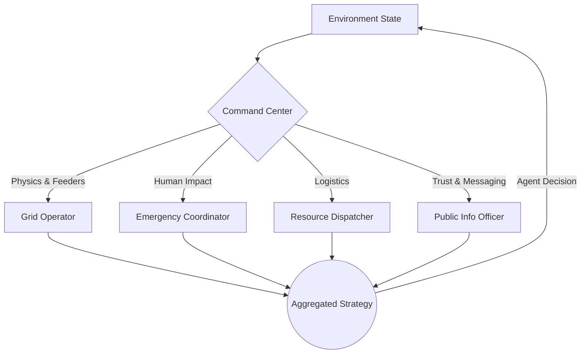
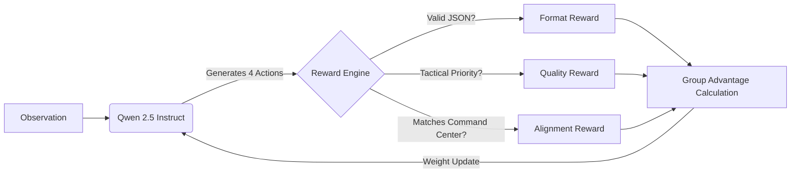

# 🏙️ Blackstart City

`Blackstart City` is an OpenEnv benchmark for **city-scale cascading blackout recovery**. 

An AI restoration commander operates inside a multi-role emergency command loop after a blackout. It must restart generation, energize substations, inspect risky lines, restore hospitals and critical services, coordinate scarce field resources, preserve public trust, and avoid a second collapse while the city degrades around it.

---

## 🏆 Hackathon Deliverables

> [!IMPORTANT]
> **Hugging Face Space:** [https://huggingface.co/spaces/YOUR-USERNAME/blackout-city](https://huggingface.co/spaces/YOUR-USERNAME/blackout-city) (Please ensure this is public and cloneable!)

* **Training Script:** [`blackstart_city/training/grpo_train.py`](./blackstart_city/training/grpo_train.py) (Unsloth + TRL GRPO)
* **Training Evidence:** See the embedded GRPO reward curves below.
* **Writeup / Blog:** [`docs/hf_mini_blog.md`](./docs/hf_mini_blog.md)
* **Pitch & Video:** [`docs/pitch_script.md`](./docs/pitch_script.md) & [`docs/video_script.md`](./docs/video_script.md)

---

## 🧠 Multi-Agent Architecture (Theme #1)

Instead of a single monolithic script, the environment explicitly surfaces recommendations from four specialized agents on every turn. This creates a deeply strategic planning loop (Theme #2) and tests world-modeling capabilities (Theme #3.1).



---

## 🚀 True RL Training: DeepSeek-Style GRPO

We moved past simple supervised fine-tuning and implemented **Group Relative Policy Optimization (GRPO)** using Unsloth and Hugging Face `TRL`. This removes the need for a VRAM-heavy Critic model and allows our Qwen-based policy to learn rapidly on a single GPU.



### GRPO Training Evidence

We track three independent multi-objective reward signals during training to ensure the model learns syntax, tactics, and overarching strategy simultaneously.


---

## 🏗️ Environment Design

The environment uses typed, structured observations and actions.

### Task Families
| Task ID | Difficulty | What It Tests |
|---|---|---|
| `local_blackstart` | Easy | basic blackstart sequencing and restoring one hospital |
| `island_rejoin` | Medium | inspection, multi-island recovery, and safe synchronization |
| `city_cascade_recovery` | Hard | city-scale recovery under backup timers and cascading-failure risk |

### Action Space (`BlackstartAction`)
* `start_generator`, `energize_substation`, `inspect_line`, `close_line`, `open_line`
* `restore_critical_node`, `restore_zone`, `shed_zone`
* `sync_islands`, `activate_battery_support`, `publish_status`

### Observation Space (`BlackstartObservation`)
* **Physical Grid:** Generation, Load, Frequency, Reserve Margin.
* **Assets:** Generators, Substations, Lines, Population Zones.
* **Critical Nodes:** Hospitals, Telecom, Water, Emergency (with active countdown timers).
* **Command Center:** Coordination score, public trust, dispatch pressure, and multi-agent recommendations.

---

## ⚙️ Local Setup

```bash
python -m venv .venv
# On Windows: .venv\Scripts\Activate.ps1
source .venv/bin/activate

pip install --upgrade pip
pip install -e .[dev]
```

*(This project complies with the OpenEnv structure and utilizes `openenv-core`.)*

### Run Locally

Start the FastAPI server:
```bash
python -m server.app
```
Then navigate to: `http://127.0.0.1:8000/web`

### Validation & Testing
```bash
# Run unit tests
python -m pytest -q

# Run baseline inference
python inference.py

# Verify OpenEnv compliance
openenv validate
```

---
*Built for the OpenEnv Hackathon.*
