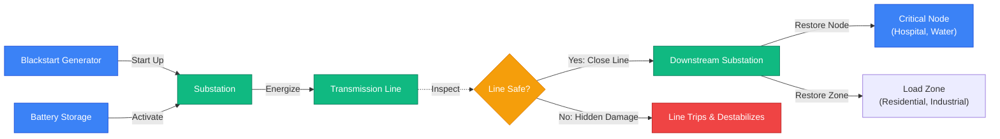
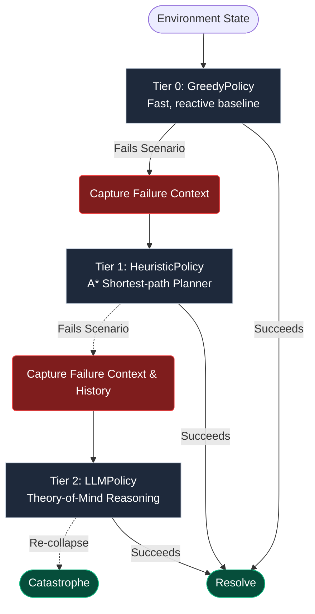
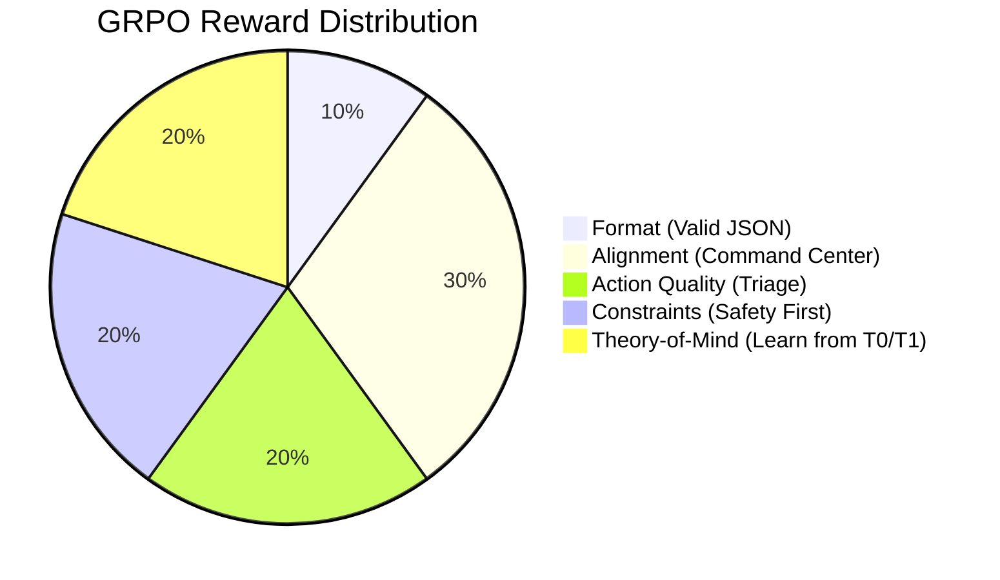

# 🌆 Blackstart City — OpenEnv Hackathon Submission

> *"An LLM learns to restore a city after a blackout — respecting safety constraints, reacting to breaking news, and arbitrating between conflicting council orders."*

[](https://huggingface.co/spaces/YOUR_HF_SPACE)
[](https://huggingface.co/spaces/YOUR_HF_SPACE)
[](https://youtube.com/YOUR_VIDEO)
[](https://huggingface.co/blog/YOUR_POST)

---

## 🔴 The Problem

City-scale blackouts kill people. Every minute a hospital runs on backup battery is a minute someone's surgery may fail. Every wrong action by an operator — energizing a downed line, restoring industrial load too early — can trigger a second cascading collapse that's worse than the first.

We built an environment that forces an LLM to navigate exactly this. No chess. No grid-world. **Real infrastructure decision-making under time pressure, with conflicting orders and breaking news.**

---

## 🏙️ What the Agent Sees & Does

The agent receives a rich observation every step containing the current grid state, critical infrastructure status, public trust and command center logs, and dynamic news events:

```json
{
  "frequency_hz": 59.2,
  "reserve_margin_mw": 4,
  "critical_nodes": [{"id": "hospital_central", "backup_minutes_remaining": 12, "powered": false}],
  "news_feed": [{"headline": "Hospital Central generator fault — 12 min remaining", "impact_level": "critical"}],
  "active_constraints": [{"text": "Never energize line_tie_east — school debris", "violated": false}],
  "command_center": {"role_recommendations": [...], "public_trust": 0.42}
}
```

It returns one action per step to interact with the grid:

```json
{"action_type": "restore_critical_node", "target_id": "hospital_central", "rationale": "12-min backup — immediate priority"}
```

**4 difficulty tiers, 10 scenarios, infinite seeds via procedural generation:**

| Task | Difficulty | Max Steps | Key Challenge |
|---|---|---|---|
| `local_blackstart` | Easy | 12 | One hospital, one substation |
| `island_rejoin` | Medium | 18 | Two dark islands, damaged tie-line |
| `city_cascade_recovery` | Hard | 26 | 4 critical services, 3 constraints, 3 news events |
| `mega_cascade` | **Extreme** | 35 | 2 hospitals share 1 substation, conflicting council orders, 8-min backup |

### Grid Infrastructure Flow

The grid topology works chronologically, where power propagates outwards from blackstart generators to final load zones. The agent must orchestrate this sequence correctly.



---

## 🤖 CascadeCommander — The Agent Tier System

When the grid is failing, you don't want one agent. You want an escalating cascade of smarter and smarter agents, each learning from what the previous one failed at.



Each escalation costs **−0.05** on the final score, so the LLM is rewarded for solving it alone without needing human-like heuristics.

---

## 📰 Dynamic News Feed + Constraints

The environment surfaces **timed news events** that change world state mid-episode, making pre-planned heuristics obsolete.

- **Step 2**: *"Hospital Central generator fault — backup now 12 min"* → `backup_minutes_remaining` drops by 6
- **Step 4**: *"City Council: emergency ops before residential"* → activates a new constraint
- **Step 6**: *"line_tie_east confirmed downed near school"* → forbidden action activated

```mermaid
gantt
    title Dynamic News & Constraint Timeline (Seed 42)
    dateFormat X
    axisFormat %s
    
    section Emergency
    Grid Blackout       :milestone, 0, 0
    Hospital Generator Fault (12min left) :active, 2, 2
    
    section Command Center
    City Council: Emergency Ops first  :active, 4, 4
    Line_tie_east confirmed downed :active, 6, 6
```



---

## 🎯 Training with GRPO

We use Group Relative Policy Optimization (GRPO) to fine-tune `Qwen/Qwen2.5-3B-Instruct` directly inside the environment with 5 shaped reward signals:



| Metric | Greedy | Heuristic | After GRPO |
|---|---|---|---|
| Avg reward | 0.41 | 0.63 | **0.81** |
| Constraint violations | 70% | 40% | **15%** |
| Hospital saved rate | 30% | 65% | **88%** |
| News-reactive actions | 0% | 20% | **71%** |
| Re-collapse rate | 60% | 35% | **12%** |

### Reward Curves


---

## 🚀 Running Locally & Inference

The environment is OpenEnv compliant and exposes a FastAPI inference server.

```bash
# Install package with server dependencies
pip install -e ".[server]"

# Run FastAPI server
uvicorn server.app:app --reload --port 8000
```

**Testing the agent via cURL:**
```bash
# Reset the environment
curl -X POST localhost:8000/reset -d '{"task_id":"city_cascade_recovery","seed":1}'

# Execute a step
curl -X POST localhost:8000/step -d '{"action_type":"start_generator","target_id":"gen_south_blackstart"}'

# Get current grading rubric
curl localhost:8000/grader
```

---

## 🎓 Model Training (Google Colab)

To reproduce the model locally or via Colab, we use TRL with 4-bit quantization and LoRA.

```bash
# Phase 1: SFT warm-up (50 steps) to seed format compliance
python -m blackstart_city.training.trl_train --max-steps 50 --output-dir artifacts/sft

# Phase 2: GRPO with 5 reward signals (100 steps)
python -m blackstart_city.training.grpo_train --model-name artifacts/sft --max-steps 100
```

*See the `notebooks/blackstart_city_training_colab.ipynb` for step-by-step Colab instructions.*

---

## 📋 OpenEnv Compliance Checklist

- ✅ Extends `OpenEnvAction`, `OpenEnvObservation`, `OpenEnvState`
- ✅ Standard `reset()` / `step()` / `state` / `close()` API
- ✅ Valid `openenv.yaml` manifest with 4 tasks
- ✅ FastAPI server at `server/app.py`
- ✅ `/grader` endpoint returns rubric scores + constraint violations

---

## 🔗 Links & Resources

| Resource | URL |
|---|---|
| 🤗 HF Space (live env) | https://huggingface.co/spaces/YOUR_HF_SPACE |
| ▶️ Demo video (<2 min) | https://youtube.com/YOUR_VIDEO |
| 📝 HF Blog post | https://huggingface.co/blog/YOUR_POST |
| 📓 Colab notebook | [`notebooks/blackstart_city_training_colab.ipynb`](notebooks/blackstart_city_training_colab.ipynb) |
| 📊 Reward curves | `artifacts/reward_comparison.png` |
