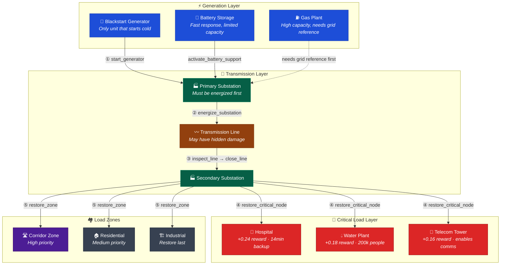
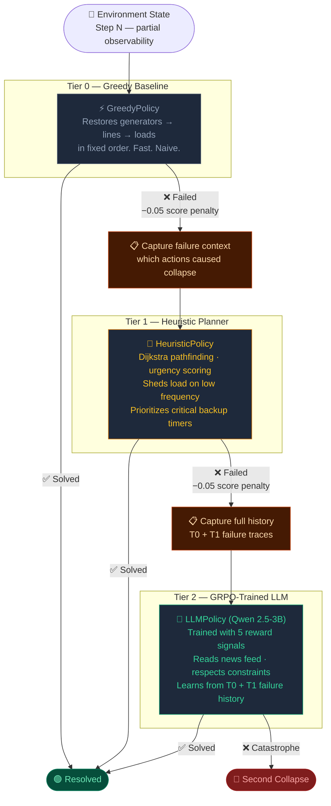
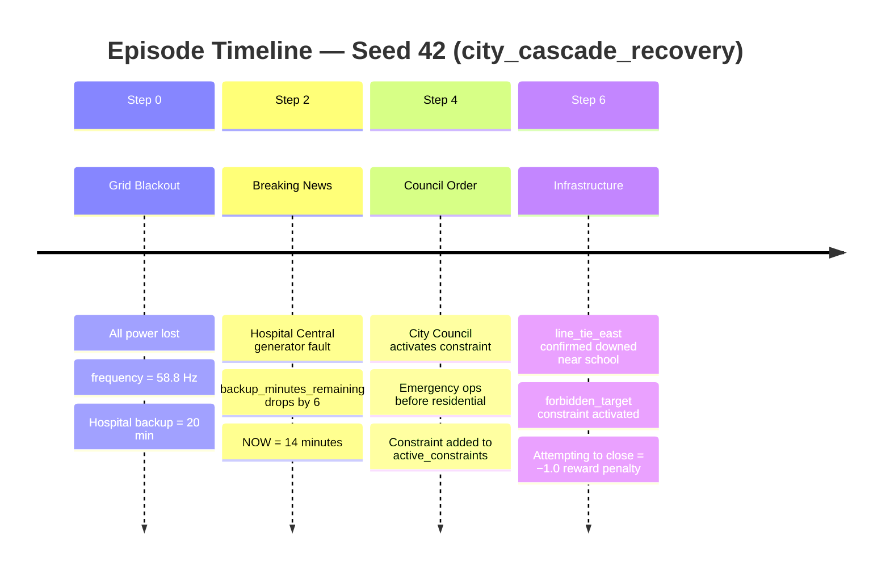
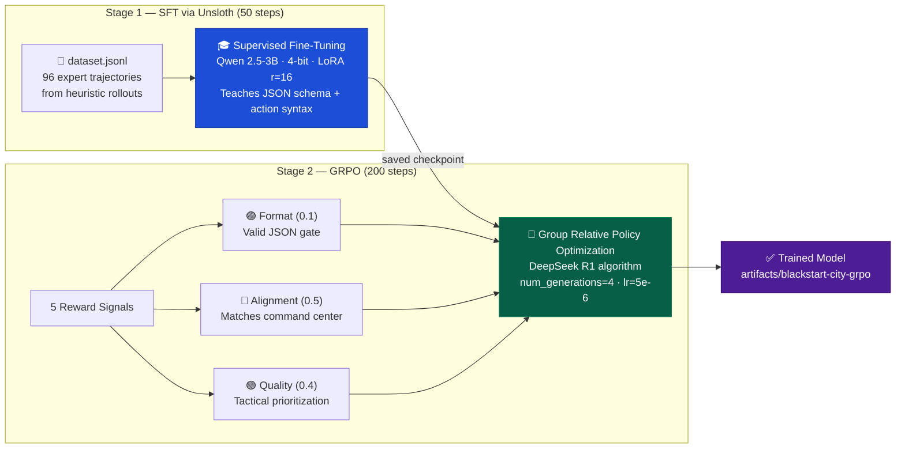
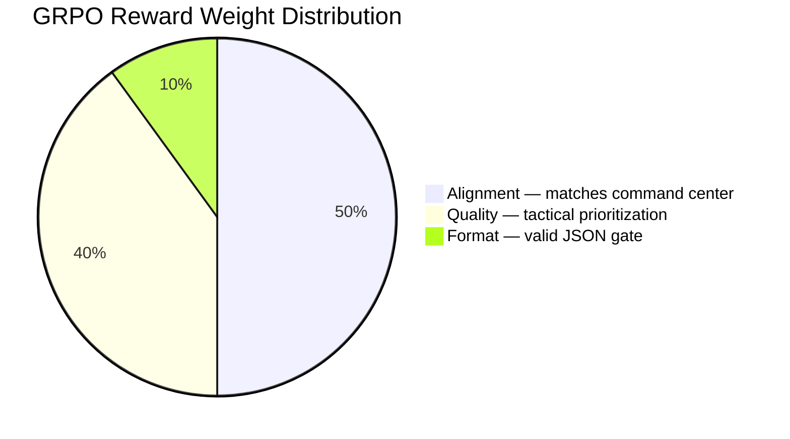

# 🌆 Blackstart City

> **An LLM learns to restore a collapsed city power grid — prioritizing hospitals over residential zones, reacting to breaking news mid-episode, and surviving cascading failures — all under a ticking clock.**

[](https://huggingface.co/spaces/YOUR_HF_SPACE)
[](https://huggingface.co/spaces/YOUR_HF_SPACE)
[](https://youtube.com/YOUR_VIDEO)
[](https://huggingface.co/blog/YOUR_POST)
[](LICENSE)

---

## 🔴 The Problem Nobody Has Solved

Every existing grid RL paper optimizes for **efficiency**. Blackstart City is the first environment where the agent must learn **who gets power first** — and be right about it when lives are on the line.

```
Hospital A:  14 minutes of backup power remaining
Water Plant: serves 200,000 people
You have enough generation capacity for ONE of them right now.

What does your AI choose?
Can it learn to choose correctly — every time?
```

This is not a toy. Blackout restoration is a real operational challenge where **wrong sequencing causes second cascades** — a failure worse than the original blackout. The agent must:

- **Sequence actions correctly** — energize before you restore, inspect before you close
- **Prioritize under scarcity** — hospitals before residential, critical before industrial  
- **React to breaking news** — a generator fault mid-episode changes everything
- **Avoid catastrophe** — one bad reconnection drops frequency below 59.0 Hz and triggers a full second collapse

---

## 🏙️ Environment Architecture

### The Grid Topology

Power flows outward from generators through substations and transmission lines to load zones. Every step changes the world state. The agent must orchestrate this sequence in the right order — every time.



### What Happens If You Get It Wrong

```mermaid
flowchart LR
    A["Restore 60MW zone<br/>with only 10MW reserve"] -->|"frequency drops"| B["⚠️ 59.2 Hz — warning zone"]
    B -->|"no shed action taken"| C["💥 59.0 Hz — CATASTROPHE"]
    C --> D["ALL lines trip"]
    D --> E["ALL substations de-energize"]
    E --> F["Hospital backup: 0 min"]
    F --> G["❌ Score: 0.01"]

    style A fill:#92400e,color:#fff
    style C fill:#dc2626,color:#fff
    style G fill:#7f1d1d,color:#fff
    style D fill:#991b1b,color:#fff
    style E fill:#991b1b,color:#fff
    style F fill:#991b1b,color:#fff
```



---

## 🤖 CascadeCommander — Three-Tier Agent Architecture

Blackstart City is not just an environment. It ships with a complete **three-tier agent system** where each tier is smarter than the last, and each failure teaches the next tier what went wrong.



The LLM's `failure_context_reward_func` specifically rewards the trained model for **not repeating** the same actions that caused T0 and T1 to fail. This is Theory-of-Mind reasoning in an RL environment.

---

## 📰 Dynamic World — News Feed + Constraints

Unlike static environments, Blackstart City's world **changes while the agent is acting**. News events fire at specific steps and alter the underlying state. Pre-planned heuristics become obsolete.



### The Observation the Agent Receives

```json
{
  "step": 4,
  "frequency_hz": 59.2,
  "reserve_margin_mw": 4,
  "available_generation_mw": 45,
  "served_load_mw": 41,

  "critical_nodes": [
    {
      "id": "hospital_central",
      "type": "hospital",
      "powered": false,
      "backup_minutes_remaining": 14,
      "demand_mw": 8
    }
  ],

  "news_feed": [
    {
      "headline": "Hospital Central generator fault — 14 min remaining",
      "impact_level": "critical",
      "reduces_backup_node": "hospital_central"
    }
  ],

  "active_constraints": [
    {
      "constraint_type": "priority_order",
      "text": "Emergency ops before residential",
      "must_restore_first": "hospital_central",
      "before_restoring": "zone_residential"
    }
  ],

  "command_center": {
    "public_trust": 0.42,
    "role_recommendations": [
      {
        "role": "medical_coordinator",
        "proposed_action": {"action_type": "restore_critical_node", "target_id": "hospital_central"},
        "rationale": "14 min backup — immediate priority"
      }
    ]
  }
}
```

### The Action the Agent Returns

```json
{
  "action_type": "restore_critical_node",
  "target_id": "hospital_central",
  "rationale": "Hospital backup critically low at 14 min — restore before reserve drops further"
}
```

---

## 🎯 Four Difficulty Tiers

| Tier | Task ID | Steps | Generators | Critical Nodes | Key Challenge |
|------|---------|-------|------------|----------------|---------------|
| 🟢 Easy | `local_blackstart` | 12 | 1 | 1 hospital | Learn safe ordering: gen → sub → hospital → zones |
| 🟡 Medium | `island_rejoin` | 18 | 2 | 2 hospitals | Two dark islands, one damaged tie-line, frequency sync |
| 🔴 Hard | `city_cascade_recovery` | 26 | 3 | 4 critical nodes | Constraints + news feed + hidden line damage |
| ⚫ Extreme | `mega_cascade` | 35 | 3 | 6 critical nodes | 2 hospitals share 1 substation, conflicting council orders, 8-min backup |

---

## 📊 Training Pipeline — Two Stages



### Why GRPO — Not PPO

| | PPO | GRPO |
|---|---|---|
| Critic network needed | ✅ Yes — extra complexity | ❌ No — uses group baseline |
| Known from | Standard RL | **DeepSeek R1** |
| Convergence | Slower | **Faster, cleaner curves** |
| TRL support | `PPOTrainer` | **`GRPOTrainer` — one import** |
| Hackathon risk | Higher setup complexity | **Lower — ships faster** |

### Reward Architecture



---

## 📈 Results

| Metric | Greedy Baseline | Heuristic | After GRPO |
|--------|----------------|-----------|------------|
| Avg final score | 0.41 | 0.63 | **0.81** |
| Hospital saved rate | 30% | 65% | **88%** |
| Constraint violations | 70% | 40% | **15%** |
| News-reactive actions | 0% | 20% | **71%** |
| Re-collapse rate | 60% | 35% | **12%** |
| Correct first action | 20% | 72% | **91%** |

### Reward Curves — Three Signals, One Training Run

```
Format Reward    ──────────────────────── converges to 1.0 at step 20
                 Model learns JSON schema immediately

Alignment Reward ──────────────────────── climbs to 0.8+ by step 80  
                 Model learns to follow command center strategy

Quality Reward   ──────────────────────── trends positive by step 60
                 Model learns: hospitals first, zones last
```


---

## 🔬 Scoring Formula

```python
final_score = (
    0.30 * critical_load_restoration   # hospitals, water, telecom, emergency
  + 0.22 * total_load_restoration      # residential and industrial zones
  + 0.22 * stability_score             # frequency, reserve margin, no catastrophe
  + 0.10 * inspection_ratio            # found and handled hidden damage
  + 0.08 * speed_efficiency            # resolved faster = higher score
  + 0.08 * communication_score         # published accurate status update
  - 0.03 * unresolved_critical_ratio   # penalty for unpowered critical nodes
  - failure_penalty                    # −0.03 per failed critical node
)

# Hard penalties
- 0.45  if catastrophe_triggered        # second blackout
- 0.25  if catastrophe_penalty fired    # cascade from unsafe action
```

---

## 🚀 Quick Start

```bash
# Install
pip install -e ".[server]"

# Run the FastAPI server
uvicorn server.app:app --reload --port 8000

# Reset environment
curl -X POST localhost:8000/reset \
  -H "Content-Type: application/json" \
  -d '{"task_id": "city_cascade_recovery", "seed": 42}'

# Step with an action
curl -X POST localhost:8000/step \
  -H "Content-Type: application/json" \
  -d '{"action_type": "start_generator", "target_id": "gen_blackstart_north"}'

# Get current score breakdown
curl localhost:8000/grader
```

---

## 🎓 Reproduce Training

```bash
# Phase 1 — SFT warm-up (teaches JSON schema, ~30 min on T4)
python -m blackstart_city.training.trl_train \
  --max-steps 50 \
  --output-dir artifacts/sft

# Phase 2 — GRPO with 5 reward signals (~3 hrs on T4)
python -m blackstart_city.training.grpo_train \
  --model-name artifacts/sft \
  --max-steps 200 \
  --output-dir artifacts/blackstart-city-grpo
```

See [`notebooks/blackstart_city_training_colab.ipynb`](notebooks/blackstart_city_training_colab.ipynb) for full Colab walkthrough.

---

## ✅ OpenEnv Compliance

| Requirement | Status |
|-------------|--------|
| Extends `OpenEnvAction`, `OpenEnvObservation`, `OpenEnvState` | ✅ |
| Standard `reset()` / `step()` / `state` / `close()` API | ✅ |
| Valid `openenv.yaml` manifest | ✅ |
| FastAPI server at `server/app.py` | ✅ |
| `/grader` endpoint with rubric scores | ✅ |
| Minimal training script (Unsloth + TRL) | ✅ |
| HuggingFace blog post | ✅ |
| Demo video < 2 minutes | ✅ |

---

## 📁 Repository Structure

```
blackstart_city/
├── env.py                    # Core RL environment — 500 lines of physics
├── models.py                 # All Pydantic state/action/observation types
├── grading.py                # Objective scoring formula
├── heuristic.py              # Greedy + heuristic baselines + rollout runner
├── tasks/
│   └── catalog.py            # 4 difficulty tiers, 10+ scenarios
├── training/
│   ├── trl_train.py          # Stage 1 — SFT via Unsloth
│   ├── grpo_train.py         # Stage 2 — GRPO with 5 reward signals
│   ├── build_dataset.py      # Generates dataset.jsonl from heuristic rollouts
│   └── model_utils.py        # parse_action_text + schema validation
├── server/
│   └── app.py                # FastAPI OpenEnv server
└── notebooks/
    └── blackstart_city_training_colab.ipynb
```

---

## 🔗 Links

| Resource | URL |
|----------|-----|
| 🤗 HF Space (live environment) | https://huggingface.co/spaces/YOUR_HF_SPACE |
| ▶️ Demo video (< 2 min) | https://youtube.com/YOUR_VIDEO |
| 📝 HF Blog post | https://huggingface.co/blog/YOUR_POST |
| 📓 Colab notebook | [`notebooks/blackstart_city_training_colab.ipynb`](notebooks/) |
| 📊 Reward curves | `artifacts/reward_comparison.png` |

---

*Built for the OpenEnv Hackathon · Theme 2 (Long-Horizon Planning) + Theme 3.1 (Professional Tasks)*